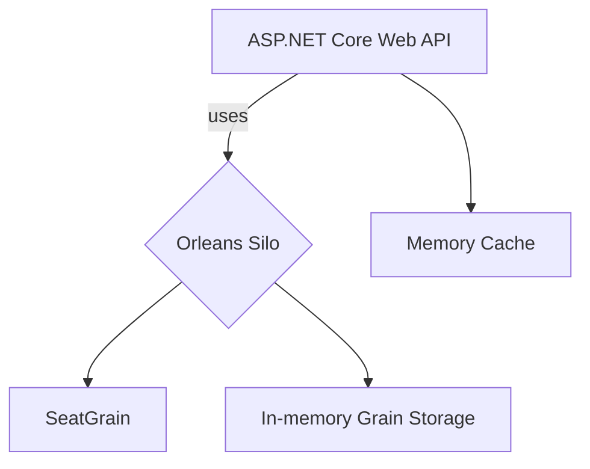

# Ticket Availability Sample

This repository contains a simple ASP.NET Core application using the Orleans framework to manage seat availability in-memory. It demonstrates how to offload seat locking logic from a database to Orleans grains with an in-memory cache.

## Running the application

Ensure you have the .NET 8 SDK installed. From the repository root run:

```bash
# restore and run the web application
dotnet run --project TicketAvailability.Web
```

The API exposes endpoints to check availability, lock and unlock seats:

- `GET /seats/{eventId}/{seatId}` – returns the availability of a seat.
- `POST /seats/{eventId}/{seatId}/lock` – attempts to lock the seat (returns 200 on success or 409 when already locked).
- `POST /seats/{eventId}/{seatId}/unlock` – unlocks the seat.

Swagger UI is enabled during development at `https://localhost:5001/swagger`.

## Running tests

Execute all unit and integration tests with:

```bash
dotnet test TicketAvailability.sln
```

The tests include scenarios with high contention to ensure only one lock succeeds when many requests compete for the same seat.

## Large venues

The tests include cases that load thousands of `SeatGrain` instances to simulate very large venues. Each seat is activated in the silo and verified to be available and lockable. This demonstrates that Orleans can manage many grains in memory without additional infrastructure.

## Architecture


